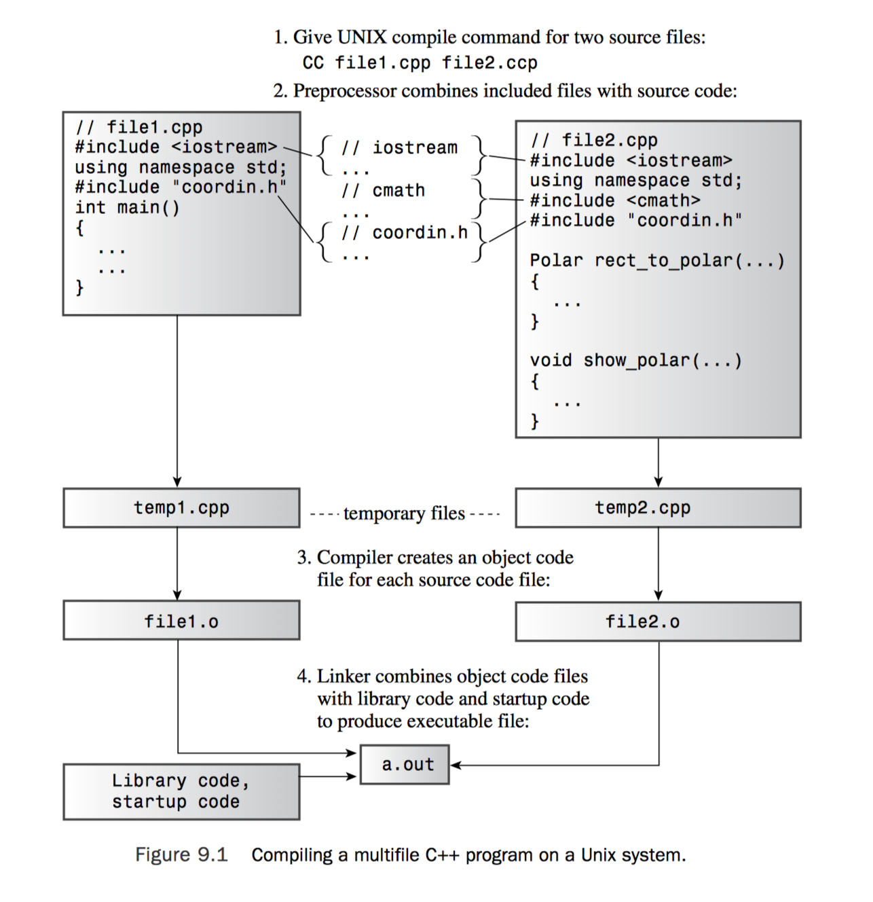

# 编译与链接

了解编译器是如何对源代码进行编译与链接，有助于对外部变量等概念的理解。



## 编译

C++标准支持你把一个程序的多个部分写在不同文件里，并且它也鼓励这么做。

> 函数声明（function declaration)：定义函数的接口。
>
> 函数定义（function definition）：实现函数。

**当编译一个C++源文件的时候：**

- 编译器会分别编译源文件中的各个函数
  - 函数调用通过函数签名定位（函数名和参数）。
  - 对于源文件中出现的所有函数调用，该文件中必须有其对应的函数声明（可以没有函数定义）。
- 编译器会为静态变量分配内存空间
- 其他

经过一番编译后，编译器产生一个`.o` 的中间文件。


## 链接

由于在单文件编译过程中，某些函数的函数定义并没有写在那个文件中，而写在了其他文件中。这时候，我们需要对有其函数定义的文件进行编译，然后将两个`.o`文件链接起来。

这样，在程序执行过程中，在A文件中产生的函数调用，才能找到对应的函数定义进行执行。


## .h 头文件

由上可知，在编译的时候，每个含有某个函数调用的文件中都必须包含该函数的函数声明，然而，如果我有很多文件都包含了很多相同的函数调用，这样我们必须在每个文件中都写上相同的函数声明。

为了简单，C++提供了 `include` 头文件的简便方法。在头文件中放置函数声明，而当你需要用到这些声明时：

- 直接include该头文件。
- 然后在编译的时候加上含有实现这些函数的文件一起编译即可。

**头文件中常放的东西**

- Function prototypes
- Symbolic constants defined using #define or const
- Structure declarations
- Class declarations
- Template declarations
- Inline functions

不要把函数定义（function definition）放在头文件里，可能产生重复定义的问题。

**防止重复声明的方法**

假设这是个头文件，其内容如下。

coordin.h

```c++
#ifndef COORDIN_H_ 
#define COORDIN_H_ 
// 这里写内容
#endif
```

这样的话，下次再include的话，就只会include一次。


## 多文件程序结构

- .h文件：包含函数声明等。
- .cpp文件[类1]：实现 .h 文件中的函数声明。
- .cpp文件[类2]：include .h文件，调用函数。